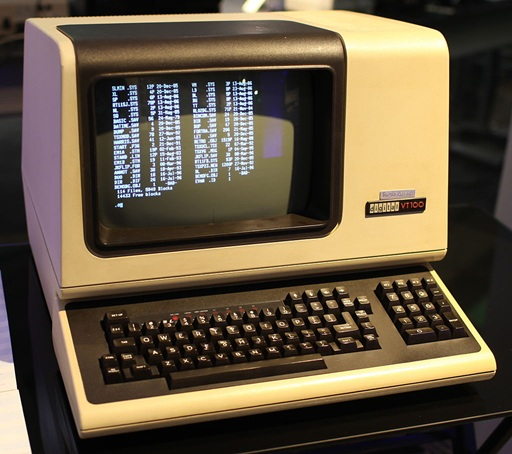
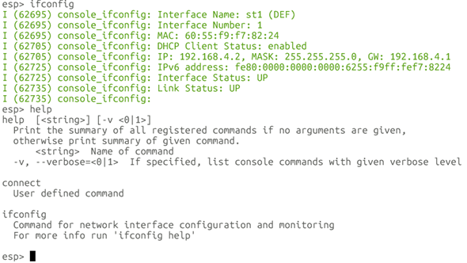
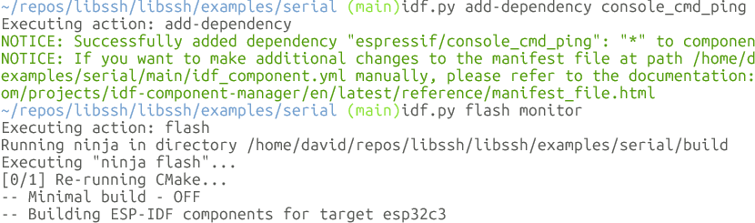
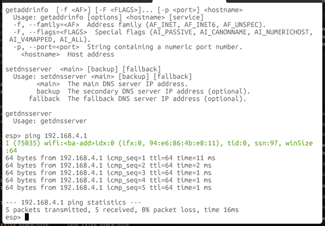
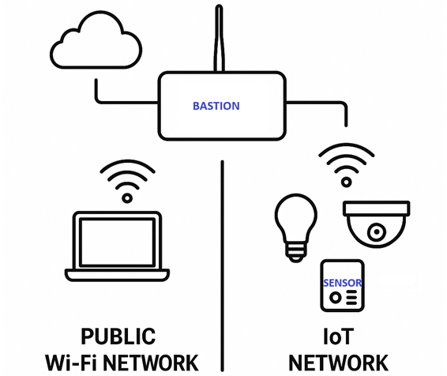
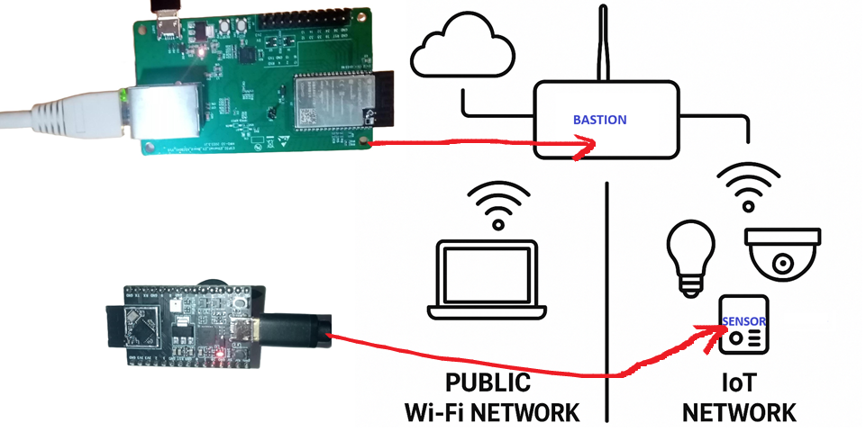
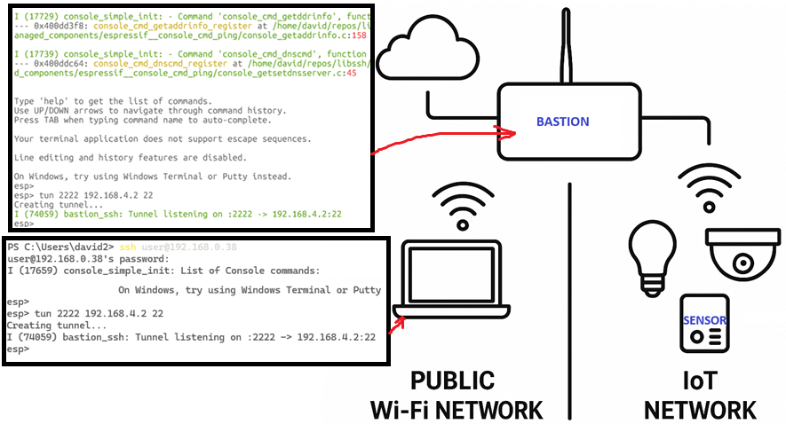
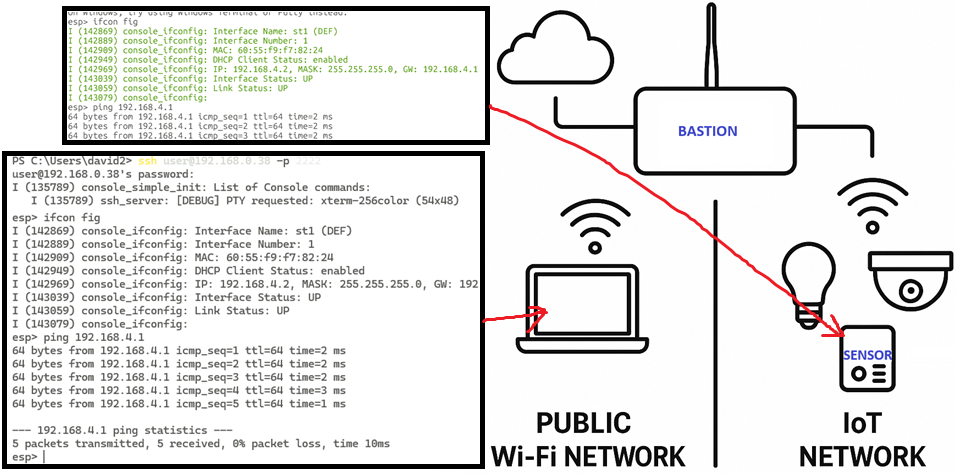

# Console Apps on Embedded Systems


#### **From serial to secure**. &nbsp;&nbsp;&nbsp;&nbsp;&nbsp; David Cermak, Embedded developer

---

## History of Terminals and Consoles

- **Early terminals (1970s)**: Electromechanical teleprinters (TTY)
- **Video terminals**: DEC VT100 (1978) with CRT screens
- **ANSI escape codes**: VT100 introduced cursor control standards
- **Smart vs Dumb terminals**: VT100 could move cursor, ADM-3 just text
- **Modern emulators**: xterm, GNOME Terminal, Windows Terminal
- **Legacy support**: Most emulators identify as "vt100" or "xterm"

---

#### Teleprinter / teletypewriter (tty)


By Pasquale Troccoli - Own work, CC BY-SA 3.0, https://commons.wikimedia.org/w/index.php?curid=32261286

---

#### VT100



By Jason Scott - Flickr: IMG_9976, CC BY 2.0, https://commons.wikimedia.org/w/index.php?curid=29457452

---

## ANSI Escape Sequences

**Standard**: ECMA-48 (ANSI) control sequences
- Format: `ESC [ ...` (ASCII 27 + 91)
- **Functions**: Cursor movement, colors, screen clearing
- **VT100 protocol (1978)**: Sparked broad adoption
- **Terminal types**: 80×24 text-only vs 256 colors vs Unicode
- **TERM environment**: Tells programs terminal capabilities
- **Embedded context**: Basic VT100/ANSI support, no advanced features

---

## Console Key Controls

**Navigation keys**:
- **Left/Right arrows**: Move cursor within command line
- **Up/Down arrows**: Cycle through command history
- **Tab**: Auto-complete current word
- **Backspace**: Delete character before cursor

**Control characters**:
- **Ctrl+C**: Interrupt (SIGINT) to cancel command
- **Ctrl+D**: End-of-input signal
- **Ctrl+A/E**: Start/end of line (shell dependent)

---

## Serial Console in Embedded Systems

**Hardware setup**:
- **UART interface**: TX/RX pins on microcontroller
- **USB-to-serial adapter**: Host PC connection
- **Standard parameters**: 115200 baud, 8N1 (8 data, no parity, 1 stop)

**Software tools**:
- **Linux**: `/dev/ttyUSB0`, `screen`, `minicom`
- **Windows**: `COMx`, `PuTTY`
- **ESP-IDF**: `idf.py monitor` (ANSI-capable)

**Important**: Raw serial needs ANSI support for line editing!

---

## Network Consoles: Telnet vs SSH

**Telnet (1960s, port 23)**:
- Plaintext remote terminal
- **Security issue**: All data unencrypted
- Credentials sent in clear text
- Mostly obsolete today

**SSH (Secure Shell, port 22)**:
- Encrypted, authenticated terminals
- Public-key or password authentication
- **Standard**: Almost all remote console access
- Built-in on Unix/Linux/macOS

---

## ESP-IDF Console Component

**Based on linenoise library** (~850 lines, BSD-licensed)

**Features**:
- **Line editing**: Backspace, cursor movement, history
- **Argument parsing**: Argtable3 for GNU-style options
- **Command registration**: Custom command handlers
- **REPL environment**: Read-Evaluate-Print loop
- **Hints**: Real-time command suggestions

**Requirements**: ANSI-compatible terminal for full functionality

---

## ESP-IDF Console in Practice

**Usage**:
```bash
# Connect via serial
idf.py monitor
```

**Interactive features**:
- **Prompt**: `esp>` with full line editing
- **History**: Arrow keys to recall commands
- **Completion**: Tab for function names
- **Rich CLI**: Sophisticated text interface on microcontrollers

**Troubleshooting**: If you see `^[6n` instead of cursor movement, your terminal doesn't support ANSI sequences

---

## Simple serial console 1/3




---

## Simple serial console 2/3 -- add new commands (ping)



---

## Simple serial console 3/3 -- ping available!



---

## Bastion demo



---

## Bastion on **ESP32-WROVER**; Sensor on **ESP32C3**



---
## SSH to Bastion, Create tunnel to IoT network



---

## SSH through the tunnel to **Sensor**



---

## Summary

1. **Terminal standards**: ANSI/VT100 codes are universal
2. **Serial consoles**: Need ANSI support for interactive editing
3. **ESP-IDF console**: Leverages linenoise for embedded CLI
4. **Security**: SSH replaced Telnet for network access
5. **Modern embedded**: Rich text interfaces possible on microcontrollers

---

## **sshlib** on ESP32

* Flash: ~100K code, ~100K data
* SRAM: ~10K
* HEAP: ~25K per SSH connection

---

## Links

* https://github.com/david-cermak/libssh
* [console-simple_init](https://github.com/espressif/esp-protocols/tree/master/components/console_simple_init)
    - [wifi-commands](https://github.com/espressif/esp-protocols/tree/master/components/console_cmd_wifi)
    - [mqtt-commands](https://github.com/espressif/esp-protocols/tree/master/components/console_cmd_mqtt)
    - [ping](https://github.com/espressif/esp-protocols/tree/master/components/console_cmd_ping)
    - [ifconfig](https://github.com/espressif/esp-protocols/tree/master/components/console_cmd_ifconfig)
* [bastion demo](https://github.com/david-cermak/libssh/tree/main/libssh/examples/bastion#bastion-ssh-tunnel-esp32)
