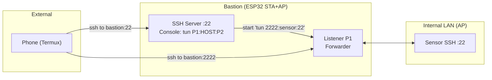

# Bastion SSH Tunnel (ESP32)

This example runs an SSH server on ESP32 that can act as a small “bastion”. It provides a console command to create a TCP tunnel on the device without relying on `ssh -L/-R` client flags.

- Command: `tun <P1>:<HOST>:<P2>` or `tun <P1> <HOST> <P2>`
- Behavior: listens on local port `P1`; for each incoming connection, it connects to `<HOST>:<P2>` and forwards bytes both ways.

## Build & Flash

- Configure Wi-Fi and build: `idf.py menuconfig && idf.py build flash monitor`
- Default SSH port: `22` (see `bastion.c`)
- Connect from a client: `ssh user@<bastion-ip>`

## Usage

- Start a tunnel: `tun 2222:sensor:22`
- From another client/tab: `ssh -p 2222 user@<bastion-ip>` (will be forwarded to `sensor:22`)
- Stop a tunnel: `tunkill <P1>`

## SoftAP + STA + NAPT

This setup assumes the ESP32 runs STA+AP with NAT (NAPT) so internal devices (e.g., `sensor`) can access internet while still being reachable from the bastion. Start from ESP-IDF softAP+STA example and enable NAT per your IDF version (e.g., LWIP IP forwarding/NAPT options). Ensure the AP subnet can reach the STA uplink via NAT.

## Notes

- Ed25519 keys recommended for host and clients.
- Do not commit private keys. Place host key under `main/ssh_host_ed25519_key`.
- This example includes a simple REPL and tunnel tasks; adapt buffer sizes and stack sizes to your board.
